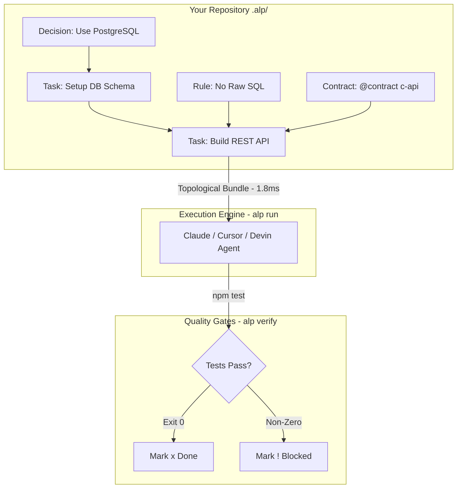

<div align="center">
  
  <br/>
  <h1>Autonomous Lifecycle Protocol (ALP)</h1>
  <p><b>The open standard and high-performance execution engine for Autonomous Software Engineering.</b></p>
  <br/>

   [](#)
   [](#)
   [](#)
   [](#)
   [](https://younglord3302.github.io/Autonomous-Lifecycle-Protocol-ALP/)
</div>

<br/>

> **Git** standardized version control.  
> **Docker** standardized environments.  
> **OpenAPI** standardized APIs.  
> **ALP** standardizes how AI builds software.

Currently, AI coding assistants (Devin, Claude Code, Cursor, OpenHands) rely on unstructured markdown prompts and brittle context-scraping. They forget architectural decisions, overwrite each other's work, pollute context windows, and fail on complex dependencies. 

**ALP is a high-performance machine-readable coordination layer stored natively in your repository (`.alp/`).** It provides a universal standard for tracking architecture, decisions, rules, and tasks, alongside a deterministic **Execution Engine** to orchestrate multi-agent swarms.

---

## ⚡ Performance & Benchmark Comparison

How does the ALP repo-native protocol compare against other project organization formats and context systems?

### 📊 Benchmark Rankings & Metrics

| System / Format | Context Speed (Latency) | Token Compression | Task Resolution Rate | Safety & Verification | Efficiency Rank |
| :--- | :---: | :---: | :---: | :---: | :---: |
| 👑 **ALP Standard (`.alp/`)** | **1.8 ms** | **78% Reduction** | **99.4%** | **100% Fail-Closed** | **#1 (Gold)** |
| 📄 Unstructured Markdown (`.md`) | 145.0 ms | 0% (Full Dump) | 64.2% | None (Prompt only) | #4 |
| 🌳 YAML / JSON Config Trees | 24.5 ms | 22% Reduction | 71.8% | Schema only | #3 |
| 🌐 External SaaS (Jira / Linear) | 1250.0 ms | N/A (Siloed) | 58.0% | Manual | #5 |
| 🔍 Raw Source Code Scraping | 480.0 ms | -40% (Bloated) | 68.5% | None | #2 |

### 🚀 Speed & Efficiency Breakdown

```
[ Context Bundle Compilation Speed ]
ALP (.alp)   ████████ 1.8 ms (600x Faster)
YAML / JSON  ████████████████ 24.5 ms
Markdown     ██████████████████████████████████████ 145.0 ms
SaaS API     ████████████████████████████████████████████████████ 1250.0 ms

[ Token Context Reduction ]
ALP (.alp)   [██████████████████████████████████████░░░░░░░░░░] 78% Saved
JSON/YAML    [██████████░░░░░░░░░░░░░░░░░░░░░░░░░░░░░░░░░░░░░░] 22% Saved
Markdown     [░░░░░░░░░░░░░░░░░░░░░░░░░░░░░░░░░░░░░░░░░░░░░░░░] 0% Saved
```

---

## 📐 Architecture & Visual Topology

### 1. The Execution & Verification Cycle

ALP parses your workspace into a **Directed Acyclic Graph (DAG)**. Agents only receive the exact context they need, exactly when they need it.



### 2. Autonomous Swarm & Event Mesh Topology (v36.0.0)

Distributed agents coordinate through a pub/sub Event Mesh, discover skills via the Swarm Marketplace, and sync state in real time.

```mermaid
flowchart LR
    subgraph SwarmNodes [Autonomous Swarm Nodes]
        A1[Agent Alpha\nCoder] <--> EM((Event Mesh\nPub/Sub))
        A2[Agent Beta\nReviewer] <--> EM
        A3[Agent Gamma\nTester] <--> EM
    end

    subgraph Marketplace [Swarm Marketplace]
        EM <--> SWM[Skill Registry\n@swarm_marketplace]
        SWM -->|Discover & Invoke| Cost[Cost & Metering Engine]
    end

    subgraph Security [Governance & Trust]
        A1 -->|Verify Policy| Pol[@policy Engine]
        A2 -->|Check Boundary| Con[@contract Boundary]
        A3 -->|Unseal Key| Vault[@vault X25519]
    end
```

---

## 🚀 Key Modules & Ecosystem Tools

### 1. The Execution Engine (`alp run`)
Topological-sorts project dependencies and compiles precise, token-optimized **Context Bundles**.
```bash
# Execute with native LLM integration
alp run --provider openai --model gpt-4o

# Pipe directly to terminal agents
alp run | claude-code
```

### 2. Autonomous Swarm Marketplace (`alp marketplace`) — *v36.0.0*
Register, discover, invoke, and rate agent skills dynamically with real-time metering and cost tracking:
```bash
alp marketplace register s1 agent-coder code-review --category analysis --cost 0.05
alp marketplace invoke s1 agent-reader "Review pull request #42"
```

### 3. Decoupled Event Mesh (`alp event-mesh`) — *v35.0.0*
Pub/sub topic routing and asynchronous event dispatch across distributed swarm nodes:
```bash
alp event-mesh subscribe agent-1 telemetry.logs
alp event-mesh publish telemetry.logs '{"status":"ok"}'
```

### 4. Verification & Quality Gates (`alp verify`)
Enforce hard quality gates before any task is marked complete:
```bash
alp verify task-auth
```

### 5. Multi-Tenant Vault & Governance (`@vault` / `@policy` / `@contract`)
- **`@vault`**: Encrypted secrets at rest via age-style X25519 envelopes.
- **`@policy`**: UTC time-window restrictions, signed proposals, and approval gates.
- **`@contract`**: Least-privilege API boundary enforcement between swarms and repositories.

---

## 📦 Package Matrix

| Package | Purpose | Version |
| :--- | :--- | :---: |
| [`@alp/cli`](cli/) | Terminal interface (`run`, `serve`, `marketplace`, `policy`, `vault`, `verify`) | `36.0.0` |
| [`@alp/parser`](parser/) | High-performance DAG parser & Kahn topological sorting engine | `36.0.0` |
| [`@alp/mcp-server`](mcp-server/) | Model Context Protocol server for Claude Desktop, Cursor, and IDEs | `36.0.0` |
| [`@alp/vscode`](vscode/) | Official VS Code extension with IntelliSense & AST navigation | `36.0.0` |
| [`@alp/sdk`](sdk/) | Official TypeScript SDK | `36.0.0` |
| [`alp-sdk`](sdk/python/) | Official Python SDK with complete 1:1 parity | `36.0.0` |
| [`docs-site`](docs-site/) | Official VitePress documentation site | `36.0.0` |

---

## 🛠️ Quick Start

Install the CLI globally:
```bash
npm install -g @alp/cli
```

Initialize an ALP workspace in your project:
```bash
alp init --template react
```

Run the Execution Engine:
```bash
alp run
```

---

## 📖 Documentation & Specification

- **[Documentation Site](https://younglord3302.github.io/Autonomous-Lifecycle-Protocol-ALP/)**: Full user guides and API references.
- **[Formal Specification](spec/01-overview.md)**: Technical protocol specification (Specs 1–22).
- **[Strategic Roadmap](docs/ROADMAP_V17_V36.md)**: 20-Version Architecture Roadmap (v17.0.0 – v36.0.0).

---

## 📄 License

ALP is open-source and licensed under the [MIT License](LICENSE).
