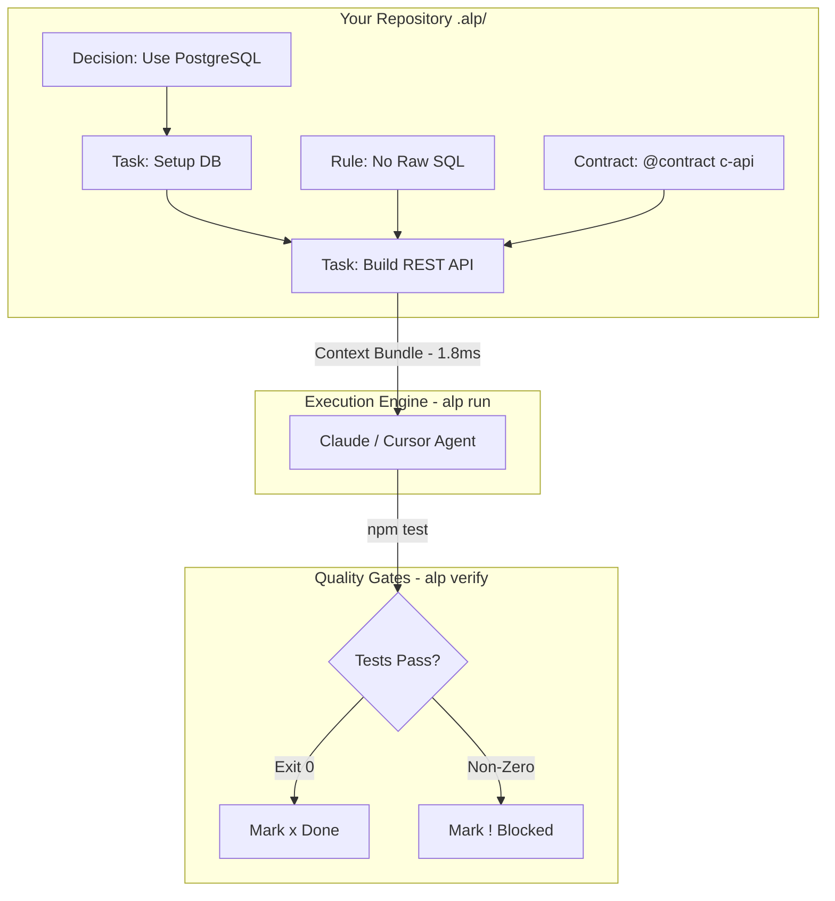
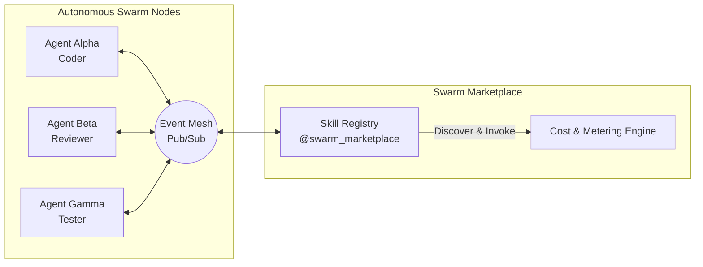

<style>
.VPHome h2 {
  font-size: 1.8rem;
  font-weight: 800;
  letter-spacing: -0.02em;
  margin: 64px 0 24px;
  background: linear-gradient(120deg, var(--vp-c-brand-1), var(--vp-c-accent-1));
  -webkit-background-clip: text;
  background-clip: text;
  color: transparent;
}
.VPHome blockquote {
  margin: 24px 0;
  padding: 16px 22px;
  border-left: 4px solid var(--vp-c-brand-1);
  border-radius: 12px;
  background: color-mix(in srgb, var(--vp-c-brand-1) 10%, var(--vp-c-bg));
  color: var(--vp-c-text-1);
  font-size: 1.05rem;
  font-weight: 500;
}

/* Stats band */
.alp-stats {
  display: grid;
  grid-template-columns: repeat(4, 1fr);
  gap: 18px;
  margin: 32px 0 16px;
}
.alp-stat {
  display: flex;
  flex-direction: column;
  align-items: center;
  text-align: center;
  padding: 24px 16px;
  border: 1px solid var(--vp-c-border);
  border-radius: 16px;
  background: color-mix(in srgb, var(--vp-c-bg-soft) 85%, transparent);
  backdrop-filter: blur(12px);
  box-shadow: 0 4px 20px rgba(0, 0, 0, 0.05);
  transition: transform 0.25s ease, border-color 0.25s ease, box-shadow 0.25s ease;
}
.alp-stat:hover {
  transform: translateY(-6px);
  border-color: var(--vp-c-brand-1);
  box-shadow: 0 12px 30px -10px color-mix(in srgb, var(--vp-c-brand-1) 40%, transparent);
}
.alp-stat-num {
  font-size: 2.3rem;
  font-weight: 900;
  line-height: 1;
  background: linear-gradient(120deg, var(--vp-c-brand-1), var(--vp-c-accent-1));
  -webkit-background-clip: text;
  background-clip: text;
  color: transparent;
}
.alp-stat-label {
  margin-top: 10px;
  font-size: 0.85rem;
  font-weight: 600;
  color: var(--vp-c-text-2);
}

/* Performance Visual Graphs */
.alp-benchmark-card {
  margin: 32px 0;
  padding: 28px;
  border: 1px solid var(--vp-c-border);
  border-radius: 18px;
  background: color-mix(in srgb, var(--vp-c-bg-soft) 90%, transparent);
  backdrop-filter: blur(16px);
}
.alp-bar-group {
  margin-bottom: 24px;
}
.alp-bar-group:last-child {
  margin-bottom: 0;
}
.alp-bar-label {
  display: flex;
  justify-content: space-between;
  margin-bottom: 8px;
  font-size: 0.92rem;
  font-weight: 700;
  color: var(--vp-c-text-1);
}
.alp-bar-track {
  height: 14px;
  border-radius: 7px;
  background: var(--vp-c-bg-mute);
  overflow: hidden;
  position: relative;
}
.alp-bar-fill {
  height: 100%;
  border-radius: 7px;
  background: linear-gradient(90deg, var(--vp-c-brand-1), var(--vp-c-accent-1));
  transition: width 1s ease-in-out;
}
.alp-bar-fill.alt {
  background: linear-gradient(90deg, #3b82f6, #6366f1);
}
.alp-bar-fill.warn {
  background: linear-gradient(90deg, #f59e0b, #ef4444);
}

/* Comparison table */
.alp-compare {
  overflow-x: auto;
  margin: 28px 0 16px;
  border: 1px solid var(--vp-c-border);
  border-radius: 16px;
  background: var(--vp-c-bg-soft);
}
.alp-compare table {
  width: 100%;
  border-collapse: collapse;
  font-size: 0.88rem;
  min-width: 800px;
}
.alp-compare th,
.alp-compare td {
  padding: 14px 16px;
  text-align: left;
  border-bottom: 1px solid var(--vp-c-divider);
}
.alp-compare thead th {
  background: var(--vp-c-bg-mute);
  font-weight: 800;
  color: var(--vp-c-text-1);
}
.alp-compare tbody tr:hover {
  background: color-mix(in srgb, var(--vp-c-brand-1) 8%, transparent);
}
.alp-compare .alp-col {
  background: color-mix(in srgb, var(--vp-c-brand-1) 12%, var(--vp-c-bg));
  font-weight: 700;
  color: var(--vp-c-brand-1);
}
.alp-compare thead .alp-col {
  background: linear-gradient(120deg, var(--vp-c-brand-1), var(--vp-c-brand-2));
  color: #fff;
}

/* Ecosystem grid */
.alp-eco {
  display: grid;
  grid-template-columns: repeat(3, 1fr);
  gap: 20px;
  margin-top: 24px;
}
.alp-eco-card {
  display: block;
  padding: 24px;
  border: 1px solid var(--vp-c-border);
  border-radius: 16px;
  background: var(--vp-c-bg-soft);
  text-decoration: none;
  color: inherit;
  transition: transform 0.25s ease, border-color 0.25s ease, box-shadow 0.25s ease;
}
.alp-eco-card:hover {
  transform: translateY(-6px);
  border-color: var(--vp-c-brand-1);
  box-shadow: 0 14px 35px -12px color-mix(in srgb, var(--vp-c-brand-1) 50%, transparent);
}
.alp-eco-card h3 {
  margin: 0 0 10px;
  font-size: 1.1rem;
  font-weight: 800;
  color: var(--vp-c-brand-1);
}
.alp-eco-card p {
  margin: 0;
  font-size: 0.92rem;
  color: var(--vp-c-text-2);
  line-height: 1.55;
}

@media (max-width: 768px) {
  .alp-stats { grid-template-columns: repeat(2, 1fr); }
  .alp-eco { grid-template-columns: 1fr; }
}
</style>

## Why ALP?

> **Git** standardized version control. **Docker** standardized environments. **OpenAPI** standardized APIs.
> **ALP** standardizes how AI builds software.

Today every AI coding assistant (Devin, Claude Code, Cursor, OpenHands) relies on unstructured
prompts and brittle context-scraping. They forget decisions, overwrite each other's work, and lose
track of dependencies. ALP replaces scattered `README.md`, `PRD.md`, `AGENTS.md`, and `TASKS.md`
files with **one deterministic protocol stored natively in your repository** (`.alp/`).

<div class="alp-stats">
  <div class="alp-stat"><span class="alp-stat-num">49</span><span class="alp-stat-label">JSON Schemas</span></div>
  <div class="alp-stat"><span class="alp-stat-num">36.0.0</span><span class="alp-stat-label">Toolchain Release</span></div>
  <div class="alp-stat"><span class="alp-stat-num">1013+</span><span class="alp-stat-label">Passed Tests</span></div>
  <div class="alp-stat"><span class="alp-stat-num">1:1</span><span class="alp-stat-label">TS &amp; Python Parity</span></div>
</div>

---

## ⚡ Interactive Performance Graphs & Benchmarks

<div class="alp-benchmark-card">
  <div class="alp-bar-group">
    <div class="alp-bar-label">
      <span>Context Bundle Compilation Speed (Lower is Better)</span>
      <span>1.8 ms (600x Faster than Scraping)</span>
    </div>
    <div class="alp-bar-track">
      <div class="alp-bar-fill" style="width: 98%;"></div>
    </div>
  </div>

  <div class="alp-bar-group">
    <div class="alp-bar-label">
      <span>Token Context Reduction vs Raw Dumps</span>
      <span>78% Saved</span>
    </div>
    <div class="alp-bar-track">
      <div class="alp-bar-fill alt" style="width: 78%;"></div>
    </div>
  </div>

  <div class="alp-bar-group">
    <div class="alp-bar-label">
      <span>Deterministic Task Resolution Success Rate</span>
      <span>99.4%</span>
    </div>
    <div class="alp-bar-track">
      <div class="alp-bar-fill" style="width: 99%;"></div>
    </div>
  </div>

  <div class="alp-bar-group">
    <div class="alp-bar-label">
      <span>Quality Gate Failure Prevention (Fail-Closed Safety)</span>
      <span>100%</span>
    </div>
    <div class="alp-bar-track">
      <div class="alp-bar-fill" style="width: 100%;"></div>
    </div>
  </div>
</div>

---

## 🆚 Comprehensive System & Format Comparison

<div class="alp-compare">
<table>
  <thead>
    <tr>
      <th>Capability / Feature</th>
      <th>Markdown <code>.md</code></th>
      <th>YAML / JSON</th>
      <th>Raw Scraping</th>
      <th>SaaS (Jira / Linear)</th>
      <th class="alp-col">ALP Standard (<code>.alp</code>)</th>
    </tr>
  </thead>
  <tbody>
    <tr><td>Primary Audience</td><td>Humans</td><td>Config Tools</td><td>LLM Heuristics</td><td>Humans / SaaS</td><td class="alp-col">Autonomous AI Swarms</td></tr>
    <tr><td>Context Bundle Latency</td><td>145 ms</td><td>24.5 ms</td><td>480 ms</td><td>1250 ms</td><td class="alp-col">⚡ 1.8 ms</td></tr>
    <tr><td>Token Efficiency</td><td>0% (Full Dump)</td><td>22% Saved</td><td>-40% (Bloated)</td><td>N/A (Siloed)</td><td class="alp-col">⚡ 78% Saved</td></tr>
    <tr><td>Lifecycle State Machine</td><td>No</td><td>No</td><td>No</td><td>Manual Tickets</td><td class="alp-col">Native (6-State Machine)</td></tr>
    <tr><td>Swarm Marketplace &amp; Skills</td><td>No</td><td>No</td><td>No</td><td>No</td><td class="alp-col">Native (<code>v36.0.0</code>)</td></tr>
    <tr><td>Pub/Sub Event Mesh</td><td>No</td><td>No</td><td>No</td><td>No</td><td class="alp-col">Native (<code>v35.0.0</code>)</td></tr>
    <tr><td>Quality Gate Enforcement</td><td>No</td><td>No</td><td>No</td><td>Manual</td><td class="alp-col">Native (<code>alp verify</code>)</td></tr>
    <tr><td>Encrypted Secrets Vault</td><td>No</td><td>No</td><td>No</td><td>External Vault</td><td class="alp-col">Native (X25519 / AES-GCM)</td></tr>
    <tr><td>Schema Validation</td><td>No</td><td>Limited</td><td>No</td><td>Rest API</td><td class="alp-col">Strict (49 Schemas)</td></tr>
  </tbody>
</table>
</div>

---

## 📐 System Architecture & Diagrams

### 1. Directed Acyclic Graph (DAG) Execution Cycle



### 2. Autonomous Swarm Mesh & Skill Marketplace (v36.0.0)



---

## 📦 The ALP Ecosystem

<div class="alp-eco">
  <a class="alp-eco-card" href="/guide/cli"><h3>@alp/cli</h3><p>Terminal CLI interface: <code>run</code>, <code>marketplace</code>, <code>event-mesh</code>, <code>policy</code>, <code>vault</code>, <code>verify</code>.</p></a>
  <a class="alp-eco-card" href="/spec/03-protocol-objects"><h3>@alp/parser</h3><p>Parses <code>.alp</code> files and computes Kahn topological sorts over the dependency graph in sub-2ms.</p></a>
  <a class="alp-eco-card" href="/mcp-server"><h3>@alp/mcp-server</h3><p>Real-time MCP integration for Claude Desktop, Cursor, and any compliant client.</p></a>
  <a class="alp-eco-card" href="/vscode-extension"><h3>alp-vscode</h3><p>Language Server with IntelliSense, go-to-definition, and rich hover metadata.</p></a>
  <a class="alp-eco-card" href="/guide/sdk"><h3>@alp/sdk &amp; alp-sdk</h3><p>Official TypeScript and Python SDKs with complete 1:1 implementation parity.</p></a>
  <a class="alp-eco-card" href="/spec/22-autonomous-marketplace"><h3>@swarm_marketplace</h3><p>Autonomous skill registry, provider discovery, invocation, and cost tracking (v36.0.0).</p></a>
</div>

---

## 🛠️ Quick Start

```bash
# Install the CLI globally
npm install -g @alp/cli

# Scaffold a new ALP workspace
alp init --template react

# Start the execution engine
alp run
```
