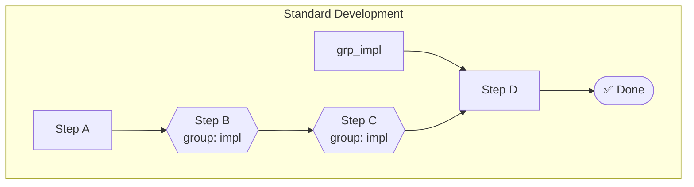

# ALP Specification — Workflow Visualization

**Version:** 10.2.0  
**Status:** Stable  

---

## 1. Overview

ALP v10.2.0 introduces **Workflow Visualization**: the ability to render
`@workflow` objects as diagrams. Because ALP workflows are machine-readable
directed graphs of steps, agents, and conditions, they can be transformed into
standard diagram formats without any external model.

This enables:
- **Human review** of complex multi-agent workflows
- **Documentation** generated directly from `.alp` files
- **CI artifacts** (PNG/SVG) published as part of a build
- **AI-assisted planning**: an LLM can read the Mermaid/DOT output to reason
  about execution order

---

## 2. Diagram Formats

### 2.1 Mermaid `flowchart`

Mermaid is the default format. It produces a `flowchart TD` (top-down) graph
with one `subgraph` per workflow.



### 2.2 CLI Usage

```bash
# Output Mermaid diagram for a workflow
alp visualize wf-standard --format mermaid --out workflow.mmd
```
