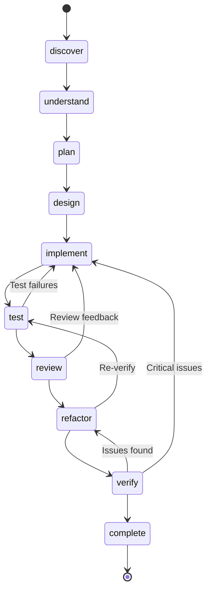
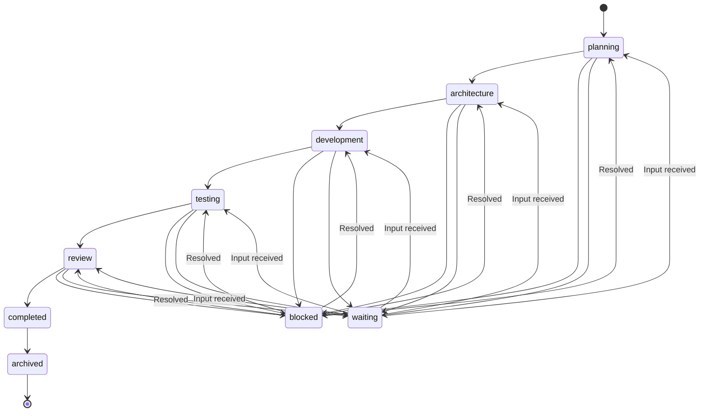
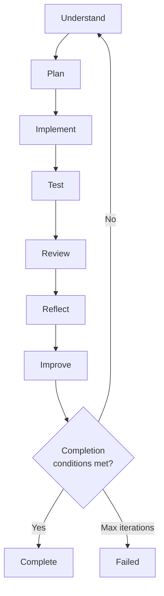
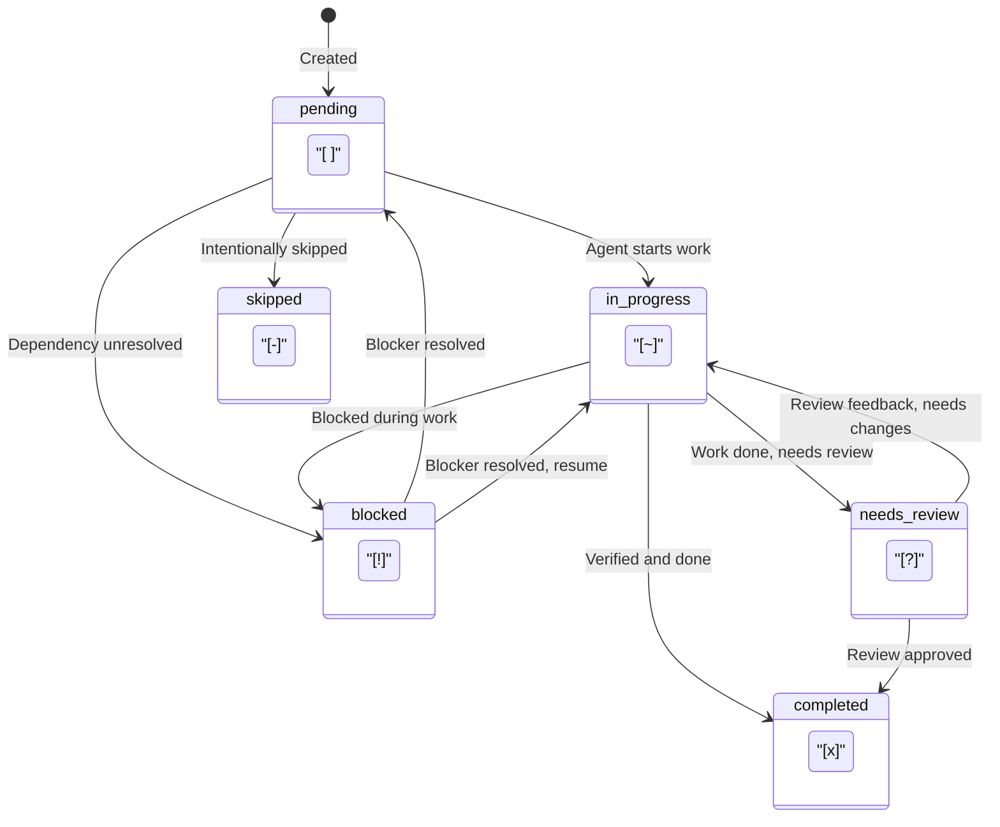
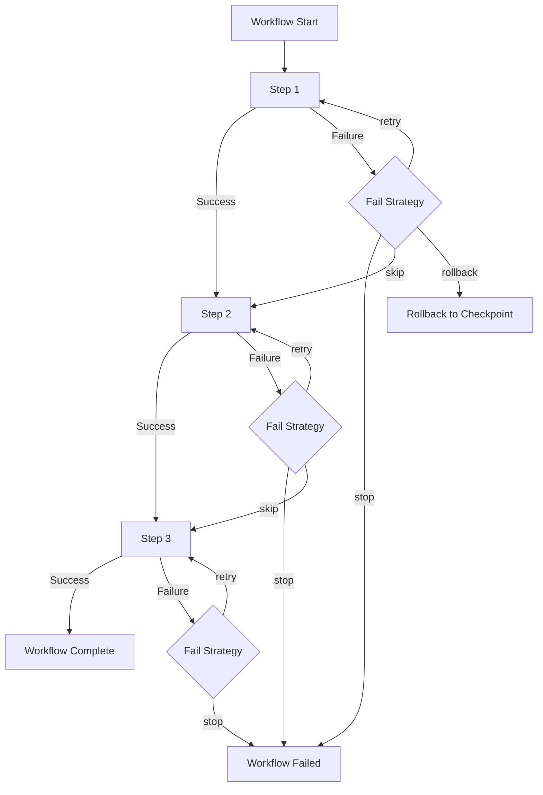
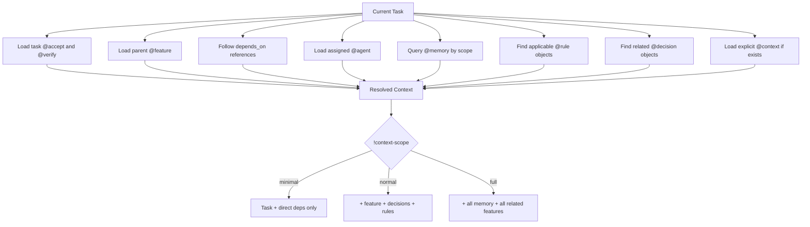
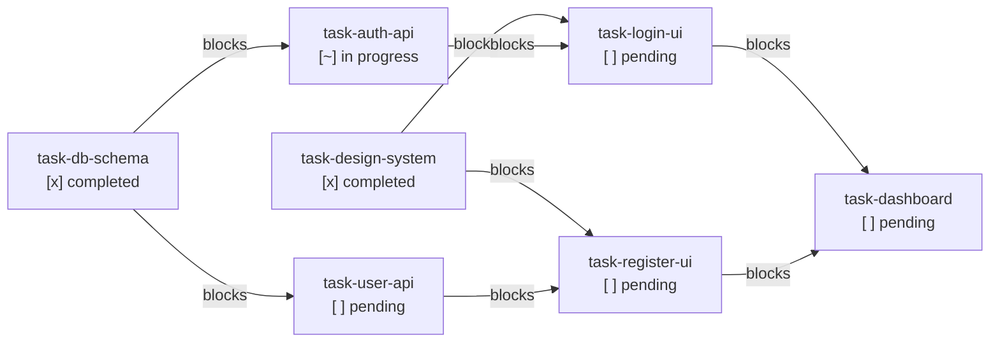
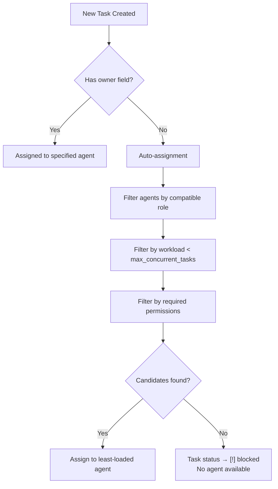

# ALP Lifecycle Diagrams

Visual diagrams for ALP's lifecycle, state machines, and engines.

---

## 1. Feature Lifecycle



---

## 2. Project State Machine



---

## 3. Loop Engine



---

## 4. Task Status Transitions



---

## 5. Workflow Execution



---

## 6. Context Loading



---

## 7. Dependency Graph Example



---

## 8. Verification Flow

```mermaid
graph TD
    START["Task marked for verification"] --> ACCEPT["Check @accept criteria"]
    ACCEPT -->|All [x]| VERIFY["Run @verify commands"]
    ACCEPT -->|Not all [x]| FAIL["Verification FAILED<br/>Incomplete acceptance criteria"]
    VERIFY --> R1{"Test?"}
    R1 -->|Pass| R2{"Lint?"}
    R1 -->|Fail + Required| FAIL
    R1 -->|Fail + Optional| R2
    R2 -->|Pass| R3{"Security?"}
    R2 -->|Fail + Required| FAIL
    R3 -->|Pass| R4{"All checks done?"}
    R3 -->|Fail + Required| FAIL
    R4 -->|Yes| REPORT["Generate Verification Report"]
    REPORT --> RESULT{"All required passed?"}
    RESULT -->|Yes| PASS["Verification PASSED ✓<br/>Task status → [x]"]
    RESULT -->|No| FAIL
    FAIL --> BACK["Task status → [~]<br/>Return to implement"]
```

---

## 9. Agent Assignment


