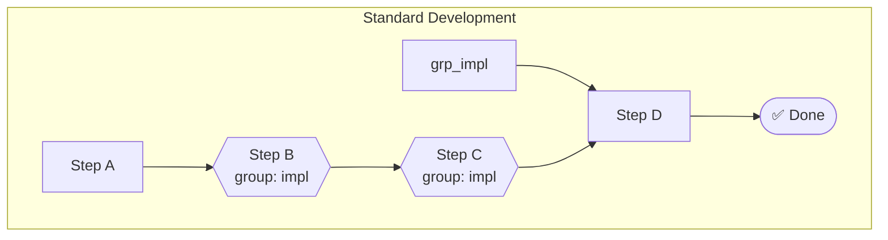
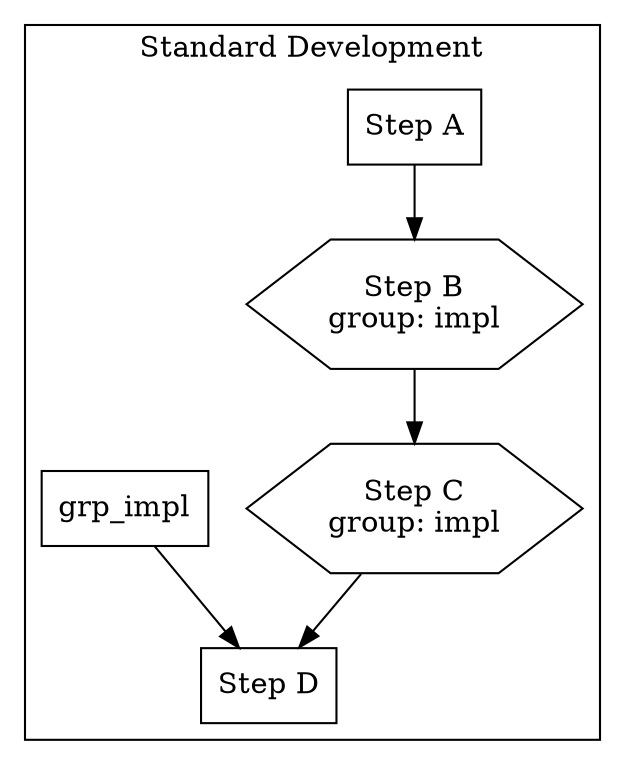

# ALP Specification — Workflow Visualization

**Version:** 10.2.0
**Status:** Stable

---

## 1. Overview

ALP v10.2.0 introduces **Workflow Visualization**: the ability to render
`@workflow` objects as diagrams. Because ALP workflows are machine-readable
directed graphs of steps, agents, and conditions, they can be transformed into
standard diagram formats without any external model.

This enables:
- **Human review** of complex multi-agent workflows
- **Documentation** generated directly from `.alp` files
- **CI artifacts** (PNG/SVG) published as part of a build
- **AI-assisted planning**: an LLM can read the Mermaid/DOT output to reason
  about execution order

---

## 2. The `@workflow` Object

A `@workflow` declares a sequence of steps to accomplish a goal. It is
defined in `.alp/workflows.alp` (or any `.alp` file loaded by the workspace).

Relevant fields for visualization:

| Field | Type | Description |
|---|---|---|
| `id` | String | Unique workflow identifier |
| `name` | String | Human-readable name |
| `goal` | String | What this workflow accomplishes |
| `steps` | List[Step] | Ordered steps to execute |

### 2.1 Step Object Fields

| Field | Type | Description |
|---|---|---|
| `name` | String | Step name |
| `task` | Ref | Task reference |
| `agent` | Ref | Agent that executes this step |
| `condition` | String | Optional ALPEL condition for execution |
| `parallel_group` | String | Steps sharing this value execute concurrently |
| `wait_for` | String | Block until the named parallel group completes |
| `on_success` | String | Next step or action on success |
| `on_failure` | String | Action on failure |

---

## 3. Diagram Formats

### 3.1 Mermaid `flowchart`

Mermaid is the default format. It produces a `flowchart TD` (top-down) graph
with one `subgraph` per workflow. Parallel groups are rendered as hexagonal
nodes (`{{label}}`) with a dashed border. `wait_for` edges connect the group
to subsequent steps.



### 3.2 Graphviz DOT

Graphviz `dot` format produces a `digraph` with one `subgraph cluster_*` per
workflow. This format is suitable for rendering PNG/SVG via `dot -Tpng`.



### 3.3 JSON

A structured JSON representation of the parsed workflows. Useful for
downstream tooling, LLM context, or custom renderers.

```json
[
  {
    "id": "wf-standard",
    "name": "Standard Development",
    "goal": "Implement a feature from design to verified completion",
    "steps": [
      { "name": "Step A", "task": "-> task-a" },
      { "name": "Step B", "task": "-> task-b", "parallel_group": "impl" }
    ]
  }
]
```

---

## 4. API

### 4.1 TypeScript

```ts
import { WorkflowVisualizer } from '@alp/parser';

const visualizer = new WorkflowVisualizer();
const workflows = visualizer.parseWorkflows(objects);

visualizer.toMermaid(workflows);  // Mermaid flowchart
visualizer.toDot(workflows);      // Graphviz DOT
visualizer.toJson(workflows);     // Structured JSON
visualizer.generate(workflows, 'mermaid'); // dispatch by format
```

### 4.2 Python

```python
from alp_sdk import WorkflowVisualizer, load_workspace

objects = load_workspace('.')
visualizer = WorkflowVisualizer()
workflows = visualizer.parse_workflows(objects)

visualizer.to_mermaid(workflows)
visualizer.to_dot(workflows)
visualizer.to_json(workflows)
visualizer.generate(workflows, 'mermaid')
```

---

## 5. CLI

```bash
# Visualize all workflows in Mermaid (default)
alp visualize

# Visualize a specific workflow
alp visualize wf-standard

# Output as Graphviz DOT
alp visualize --format dot

# Output as JSON
alp visualize --format json

# Write to file
alp visualize --format mermaid --out docs/workflow.mmd
alp visualize --format dot --out docs/workflow.dot
```

---

## 6. Limitations

- `alp visualize` renders the **declared** structure only. It does not execute
  the workflow or resolve dynamic ALPEL conditions.
- Parallel groups (`parallel_group` / `wait_for`) are shown as graph edges, not
  as concurrent execution timelines.
- Rendering to PNG/SVG is left to external tools (e.g., `mmdc` for Mermaid,
  `dot` for Graphviz).
